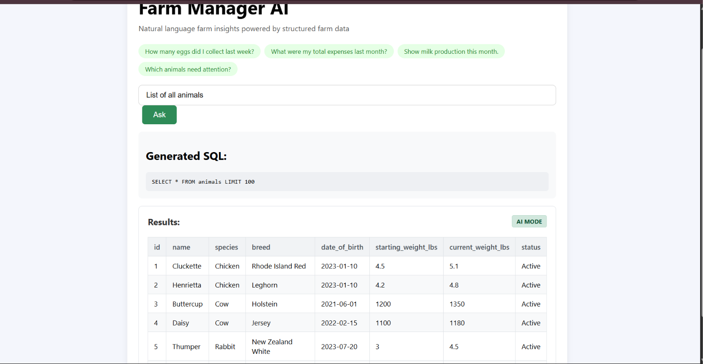
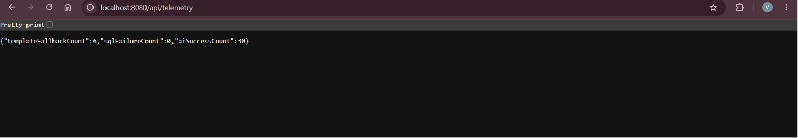
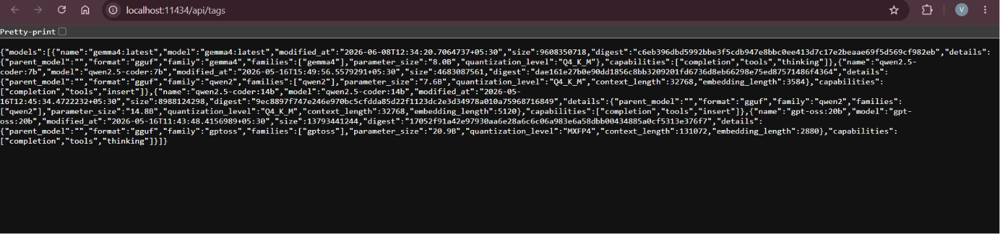
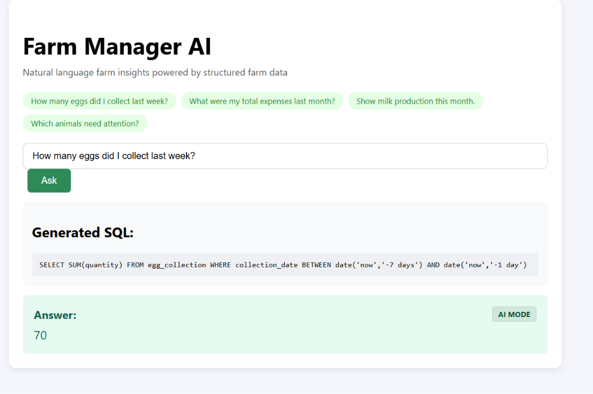

# Farm Manager AI

A local-first, AI-powered natural language interface for structured farm databases. This application allows farm operators to query livestock, crop, equipment, and financial databases in plain English and receive real-time answers along with the generated SQL. It executes entirely offline, ensuring complete data privacy and reliability in rural locations with poor connectivity.

---

## Demo

Watch the Farm Manager AI demonstration video:


---

## Screenshots

### 1. Natural Language Query Interface (AI Mode)
The interface is clean and responsive. Users can type questions or select sample queries.


### 2. Tabular Result Rendering
Multi-record datasets are rendered in a clean, borders-aligned HTML table with zebra striping.


### 3. Template Fallback Mode
If Ollama is offline or fails, the application falls back to a deterministic, regex-based matching engine.


### 4. Telemetry API Endpoint
In-memory performance metrics (successes, fallbacks, and failures) are tracked in real-time.


---

## What It Does

Farm Manager AI translates natural language questions into database queries through a secure execution pipeline:

```
[ Question ]
     │
     ▼
[ Ollama (qwen2.5-coder:7b) ] ──(Generates Raw SQL)
     │
     ▼
[ SQL Safety Validation ] ──────(Enforces Read-Only SELECT/WITH; Blocks DROP, DELETE, etc.)
     │
     ▼
[ SQLite Database ] ────────────(Executes Safe SQL)
     │
     ▼
[ Result Formatting ] ──────────(Outputs HTML Table for multi-row or scalar card for single value)
```

---

## Features

- **Local AI Integration:** Powered by a local **Ollama** instance running the **`qwen2.5-coder:7b`** model.
- **Dynamic SQL Generation:** Translates complex queries without cloud API calls, keeping all data on-premise.
- **Strict SQL Safety Interceptor:** Rejects write/structural SQL commands (`DROP`, `DELETE`, `UPDATE`, `INSERT`, etc.) and enforces read-only access.
- **Zebra-Striped Table Rendering:** Automatically renders multi-record results in responsive HTML tables and single-cell responses as formatted metric cards.
- **Deterministic Fallback Engine:** Bypasses Ollama and uses a regex pattern-matcher if the LLM is offline or times out.
- **In-Memory Telemetry:** Exposes metrics (`aiSuccessCount`, `templateFallbackCount`, `sqlFailureCount`) on a REST endpoint.
- **Dynamic Schema Cache:** Loads `schema.sql` at startup to inject fresh context into the LLM prompt without recompiling code.
- **Modern Stack:** Spring Boot 3.2.5 (Java 21), React 18, and SQLite.

---

## Architecture

The system features a decoupled backend architecture where template-matching and AI services are completely separated:

```
                  ┌─────────────────────────┐
                  │     React Frontend      │
                  └────────────┬────────────┘
                               │
                      POST /api/query
                               │
                               ▼
                  ┌─────────────────────────┐
                  │  QueryController (Java) │
                  └────────────┬────────────┘
                               │
                 ┌─────────────┴─────────────┐
                 │                           │
                 ▼                           ▼
      ┌─────────────────────┐     ┌─────────────────────┐
      │  OllamaQueryService │     │QueryTemplateService │
      │      (AI Mode)      │     │  (Template Fallback)│
      └──────────┬──────────┘     └──────────┬──────────┘
                 │                           │
         [Ollama Local API]           [Regex Patterns]
                 │                           │
                 ▼                           │
      ┌─────────────────────┐                │
      │ SQL Safety Filter   │                │
      └──────────┬──────────┘                │
                 │                           │
                 └─────────────┬─────────────┘
                               │
                               ▼
                  ┌─────────────────────────┐
                  │ JdbcTemplate Execution  │
                  └────────────┬────────────┘
                               │
                               ▼
                  ┌─────────────────────────┐
                  │ SQLite (farm_manager.db)│
                  └─────────────────────────┘
```

---

## Execution Modes

### 1. AI Mode
- **Triggers:** Automatically on user question submission if Ollama is online.
- **Process:** The question is combined with the cached database schema and passed to `qwen2.5-coder:7b`. The generated SQL is validated, executed against SQLite, and returned to the UI with a green **`[AI Mode]`** badge.

### 2. Template Mode (Fallback)
- **Triggers:** If Ollama is offline, times out (15s), or generates invalid/unsafe SQL.
- **Process:** The controller catches the exception, increments the telemetry fallback counter, and queries the `QueryTemplateService` for a deterministic regex match. The result is displayed in the UI with a blue **`[Template Mode]`** badge.

---

## API Endpoints

The Spring Boot backend exposes the following REST endpoints on port `8080`:

| Endpoint | Method | Request Body / Parameters | Description |
| :--- | :--- | :--- | :--- |
| `/api/query` | `POST` | `{ "question": "string" }` | Processes the query, trying AI mode first, then template fallback. Returns `QueryResponse` DTO. |
| `/api/questions` | `GET` | *None* | Returns the list of 10 standard queries pre-indexed for the template fallback. |
| `/api/telemetry` | `GET` | *None* | Returns a JSON map of current execution counters (`aiSuccessCount`, `templateFallbackCount`, `sqlFailureCount`). |

---

## Running Locally

### 1. Prerequisites
- **Java 21 (JDK)**
- **Node.js (v18+)**
- **Maven**
- **Ollama**

### 2. Step 1: Start Ollama and Load Model
1. Run Ollama on your machine.
2. In your terminal, fetch the model:
   ```bash
   ollama pull qwen2.5-coder:7b
   ```

### 3. Step 2: Start the Spring Boot Backend
1. Open a terminal and navigate to the backend directory:
   ```bash
   cd backend
   ```
2. Build and start the server:
   ```bash
   mvn clean install
   mvn spring-boot:run
   ```
   *The backend will automatically initialize a local SQLite database (`farm_manager.db`), run schema seeding, and start on `http://localhost:8080`.*

### 4. Step 3: Start the React Frontend
1. Open another terminal and navigate to the frontend directory:
   ```bash
   cd frontend
   ```
2. Install dependencies and start:
   ```bash
   npm install
   npm start
   ```
   *The React app will open on `http://localhost:3000`.*

---

## Future Improvements

- **Fine-Tuned Safety Parsing:** Upgrade SQL parsing to use a proper SQL parser AST library rather than word-boundary regex patterns to eliminate any potential edge cases.
- **Dynamic Telemetry Resets:** Add a `/api/telemetry/reset` endpoint to allow clearing counters during demo sessions.
- **Multi-Model Toggling:** Expose a dropdown in the UI to switch between models (e.g. `qwen2.5-coder:1.5b` for low-resource environments and `qwen2.5-coder:7b`).

---

## Lessons Learned

1. **Decouple Legacy and New Systems:** Keeping `QueryTemplateService` completely unmodified while introducing `OllamaQueryService` ensured that the fallback system remained rock-solid and bugs in the AI integration didn't break basic app functionality.
2. **Defensive AI Engineering:** Large Language Models are non-deterministic and prone to prompt injections. Adding a strict SQL safety filter before running code against the database is an absolute requirement when exposing SQL execution.
3. **Optimize Schema Contexts:** Passing the database schema as a single cached string loaded once at startup minimizes system overhead and ensures prompts remain contextually relevant without repetitive file reads.
